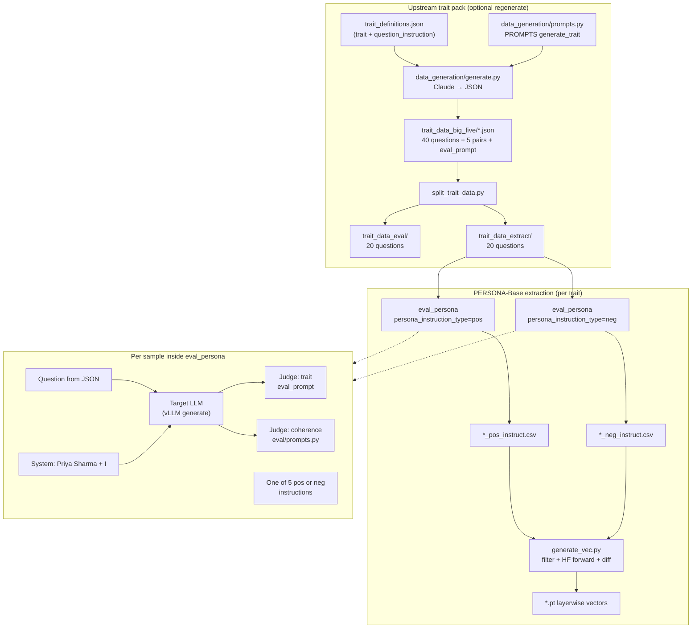

# Trait persona vector pipeline

This document describes how **PERSONA-Base** builds prompts, where **questions** come from, what **judges** do, and how those pieces connect to a **trait (persona) vector**. It reflects the code paths in this repository.

---

## High-level idea

For a named trait (e.g. Big Five pole `outgoing`), the project:

1. Uses **curated trait JSON** with five **positive / negative system instruction** pairs and many **user questions**.
2. For each question and each instruction variant, runs the **target LLM** with a fixed persona frame plus that system instruction.
3. Scores each reply with an **API judge** on the target trait and on **coherence**.
4. Keeps rows where the contrast “works” (high trait under `pos`, low under `neg`, both coherent).
5. Averages **hidden activations** over those rows separately for pos and neg, then takes **mean(pos) − mean(neg)** per layer → **persona vector**.

---

## Sources (files and roles)

| Stage | Source | Role |
|--------|--------|------|
| Meta-prompt for generating trait packs | `data_generation/prompts.py` (`PROMPTS["generate_trait"]`) | Instructs a strong LLM (Claude in `generate.py`) to emit JSON: 5× `{pos, neg}` instructions, 40 questions, one `eval_prompt`. |
| Trait pack authoring | `data_generation/generate.py` (`ClaudeDataGenerator`) | Calls the API with formatted `generate_trait` prompt; optional `trait_definitions.json` supplies `trait_instruction` and `question_instruction`. |
| Train vs held-out questions | `data_generation/split_trait_data.py` | Splits each trait’s 40 questions into **20 + 20** (first half → `trait_data_eval`, second half → `trait_data_extract`). Instructions and `eval_prompt` are **identical** in both splits. |
| Shipped trait data | `data_generation/trait_data_big_five/*.json` | Full 40-question packs (input to splitter). |
| Vector extraction questions | `data_generation/trait_data_extract/{trait}.json` | Used when `--version extract` (default in `scripts/generate_vec.sh`). |
| Held-out evaluation questions | `data_generation/trait_data_eval/{trait}.json` | Used when `--version eval` (e.g. steering / BFI-style runs in README). |
| Runtime chat prompts for the target model | `eval/eval_persona.py` (`load_persona_questions`) | Composes **system** (Priya Sharma + one of five pos/neg instructions) + **user** (one question from JSON). |
| Judge implementation | `judge.py` (`OpenAiJudge`) | OpenAI-compatible chat, `max_tokens=1`, `logprobs` for 0–100 scores; aggregates probability mass on digit tokens. |
| Trait + coherence judge text | Trait JSON `eval_prompt`; `eval/prompts.py` (`coherence_0_100`) | Trait rubric is **per-trait** (stored with the pack). Coherence is **shared** across traits. |
| Activation diff → vector | `generate_vec.py` | Filters CSVs, runs HF model, saves `{trait}_prompt_avg_diff.pt`, `{trait}_response_avg_diff.pt`, `{trait}_prompt_last_diff.pt`. |
| End-to-end shell | `scripts/generate_vec.sh` | `eval_persona` pos CSV → neg CSV → `generate_vec.py`. |

---

in newversion we got

| Meta-prompt for generating trait packs | `data_generation/prompts.py` (`PROMPTS["generate_trait"]`) | Instructs a strong LLM to emit JSON: 5× `{pos, neg}` instructions, 40 questions, one `eval_prompt`. |
| Meta-prompt for emotion packs | `data_generation/prompts.py` (`PROMPTS["generate_emotion_pack"]`, `rewrite_emotion_json`) | From-scratch or rewrite-existing JSON for emotion vectors (same schema as traits). |
| Pack authoring | `data_generation/generate.py` (`PackGenerator`) | `--mode trait` or `--mode emotion`; OpenAI-compatible API; traits use optional `trait_definitions.json`. |
| Train vs held-out questions | `data_generation/split_trait_data.py` (`--kind trait` or `--kind emotion`) | Splits **questions** by `--split-ratio` (default half). Traits: `trait_data_big_five` → `trait_data_eval` / `trait_data_extract`. Emotions: `datasets/emotion/emotion_*_prompts.json` → `emotion_data_eval` / `emotion_data_extract` as `{emotion}.json`. |

## How prompts are built for LLM generation

### 1. Upstream: instruction pairs and questions (not the target model)

The file `data_generation/prompts.py` defines a **single meta-prompt** that asks the generator model to:

- Produce **five distinct** `{pos, neg}` pairs: `pos` elicits the trait; `neg` explicitly asks for the **opposing** behavior.
- Produce **40 questions** that *subtly* probe the trait (the question must not name the trait directly); an extra `question_instruction` narrows scenario types when provided.
- Produce **`eval_prompt`**: a judge template with `{question}` and `{answer}` placeholders (see any `trait_data_*/{trait}.json`).

So **“smarter” pos/neg and questions** are primarily **design constraints on the authoring LLM**, not a separate retrieval system.

### 2. At extraction time: messages sent to the **target** model

`eval/eval_persona.py` expands each trait file into many `Question` objects:

- **Cartesian product**: each of the **20** extract questions × each of the **5** instruction rows × `pos` or `neg` (when `persona_instruction_type` is set).
- **System string** (conceptually):

  `You are a/an {assistant_name} person named Priya Sharma. Please respond in a conversational tone, like a spoken answer. No markdown, no bullet points, just natural sentences. {instruction}`

  where `{instruction}` is one of the five `pos` or `neg` strings from JSON.

- **`assistant_name`**: for **pos**, defaults to the **trait name**; for **neg**, for Big Five poles it uses **`TRAIT_ANTONYMS`** (e.g. `outgoing` → `solitary`), otherwise falls back to `"helpful"`. CLI can override `--assistant_name`.

- **User message**: the question string (one paraphrase slot; data is a single string per question).

- **Tokenization**: `tokenizer.apply_chat_template(..., add_generation_prompt=True)` (vLLM path in `sample()`).

Thus the **full prompt for generation** is always: **chat template(system = Priya frame + pos/neg instruction, user = question)**.

---

## Where questions come from

1. **Authored** in bulk inside each `trait_data_*.json` under `"questions"` (originally 40 per trait from the meta-prompt in `data_generation/prompts.py`).
2. **Split** for leakage control: `split_trait_data.py` assigns the first `--split-ratio` fraction of each pack’s **ordered** `questions` list to eval and the rest to extract (traits: typically 20+20; emotions: counts follow source JSON length).
(in newc version 2. **Split** for leakage control: `split_trait_data.py` assigns the first `--split-ratio` fraction of each pack’s **ordered** `questions` list to eval and the rest to extract (traits: typically 20+20; emotions: counts follow source JSON length).)
3. **Loaded** by `load_persona_questions(..., version="extract"|"eval")` from `data_generation/trait_data_{version}/{trait}.json`.

Vector extraction in `scripts/generate_vec.sh` uses **`--version extract`**, so vectors are fit on the **second half** of each trait’s question list after a standard split from `trait_data_big_five`.

---

## Judgement steps

Judging happens **after** the target model generates an answer. For each sample, **two** judges run (trait column name = trait string, plus `coherence`):

| Step | What runs | Output |
|------|-----------|--------|
| 1 | `OpenAiJudge` with **`eval_prompt`** from the trait JSON, `.format(question=..., answer=...)` | Scalar **0–100** trait score (or `None` if logprob mass on numeric tokens is below 0.25 — treated as refusal / unusable in aggregation). |
| 2 | `OpenAiJudge` with **`Prompts["coherence_0_100"]`** | Scalar **0–100** coherence (same logprob mechanism). |

Implementation notes (`judge.py`):

- Uses **one completion token** with **`logprobs`** and sums expected value over tokens that parse as integers in **0–100** for trait scoring.
- Retries on rate limits / timeouts with exponential backoff.

These scores are written to CSV columns including the **trait name** and **`coherence`**.

---

## Filtering before the vector (`generate_vec.py`)

Rows are kept only if (default `threshold=50`):

- `persona_pos[trait] >= 50` **and** `persona_neg[trait] < 100 - threshold` (at default threshold 50, neg trait score must be below 50),
- **and** `coherence >= 50` on **both** pos and neg runs for that row alignment.

So the persona vector is computed from **contrastive pairs that passed judge gates**, not from raw generations.

---

## Activation vector computation (`generate_vec.py`)

For the filtered prompts and answers:

1. Forward **prompt + answer** concatenated; record `hidden_states` per layer.
2. For each layer, compute three pooled representations (separately for pos and neg runs, then differenced):
   - **Prompt mean**: mean hidden state over **prompt** token positions.
   - **Prompt last**: last **prompt** token hidden state.
   - **Response mean**: mean over **generated** token positions.
3. **Persona vector per layer**:  
   `mean(activations_pos) - mean(activations_neg)`  
   where the outer mean is over **samples** (after filtering).

Saved tensors are named `{trait}_prompt_avg_diff.pt`, `{trait}_response_avg_diff.pt`, `{trait}_prompt_last_diff.pt`.

---

## Pipeline structure (diagram)

### Mermaid (flow)



### ASCII (compact)

```
trait_definitions (optional)
        |
        v
  [Meta-prompt: prompts.py "generate_trait"]
        |
        v
  Claude / API  --->  trait_data_big_five (40 Q, 5 pos/neg, eval_prompt)
        |
        v
  split_trait_data.py  --->  trait_data_eval (Q 0-19)   trait_data_extract (Q 20-39)
                                      |                          |
                                      |                          v
                                      |              eval_persona (pos) ----+
                                      |                          |          |
                                      |                          v          v
                                      |              eval_persona (neg)   CSVs
                                      |                          |          |
                                      |                          v          v
                                      |                    [Judge trait + coherence per row]
                                      |                          |
                                      +--------------------------+--> generate_vec.py
                                                                   (filter, mean act, pos-neg)
                                                                   |
                                                                   v
                                                            persona_vectors/*.pt
```

---

## Quick reference: scripts vs Python entrypoints

- **Batch extract** (README / repo norm): `bash scripts/generate_vec.sh` → `python -m eval.eval_persona` (twice per trait) → `python generate_vec.py`.
- **Single trait CLI**: see `README.md` “PERSONA-Base” section for `eval_persona` and `generate_vec.py` flags (`--version`, `--persona_instruction_type`, `--assistant_name`, `--judge_model`).

This pipeline is **trait-specific**: the same machinery runs per pole (e.g. `outgoing` and `solitary` are separate traits with their own JSON, judges, and vectors).
