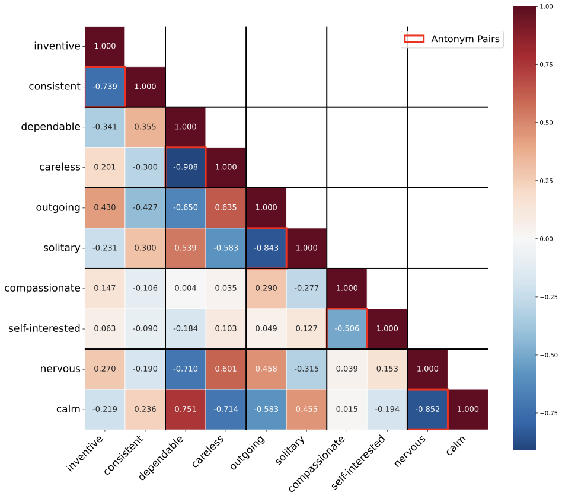
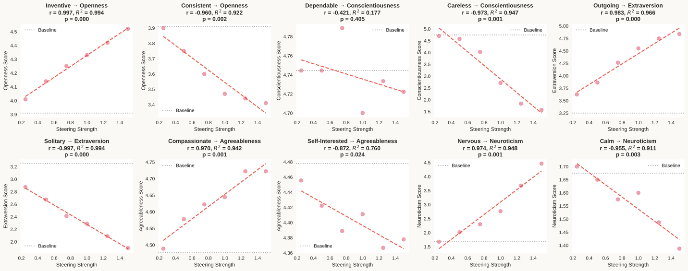
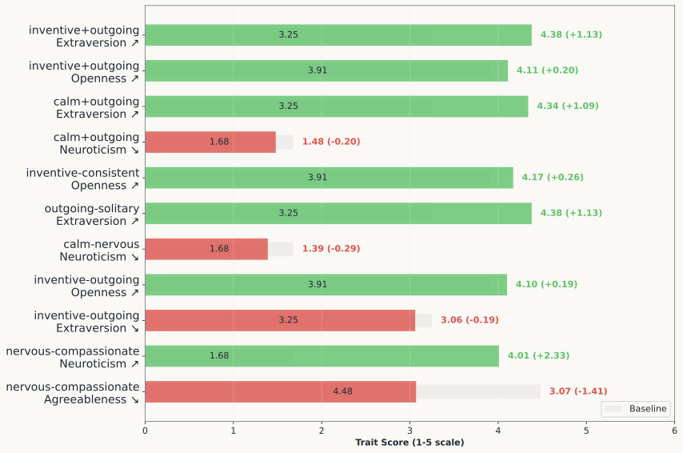

<div align="center">

# PERSONA

### Dynamic and Compositional Inference-Time Personality Control via Activation Vector Algebra

[](https://openreview.net/pdf?id=QZvGqaNBlU)
[](LICENSE)
[](https://www.python.org/)

</div>

---

Current methods for personality control in LLMs rely on static prompting or expensive fine-tuning, failing to capture the dynamic, compositional nature of human traits. **PERSONA** is a training-free framework that achieves fine-tuning level performance through direct manipulation of personality vectors in activation space. Our key insight is that personality traits appear as extractable, approximately orthogonal directions in the model's representation space that support algebraic operations.

## Overview

PERSONA operates through four integrated components:

| Component | Description |
|-----------|-------------|
| **PERSONA-Base** | Extracts orthogonal OCEAN personality vectors via contrastive activation analysis |
| **PERSONA-Algebra** | Enables compositional control through vector arithmetic (scaling, addition, subtraction) |
| **PERSONA-Flow** | Performs dynamic inference-time personality steering with context-aware adaptation |
| **PERSONA-Evolve** | Benchmarks dynamic personality control with 800 multi-turn dialogue scenarios |

### Orthogonality of Persona Vectors

Persona vectors exhibit strong orthogonality across the Big Five (OCEAN) dimensions, with opposing trait pairs showing negative cosine similarity:

<p align="center">
  
</p>

### Scalar Multiplication: Linear Control

Steering coefficients produce proportional changes in BFI-44 dimension scores, confirming strong linearity:

<p align="center">
  
</p>

### Vector Addition & Subtraction

Vector arithmetic produces predictable BFI-44 score changes, enabling compositional personality manipulation:

<p align="center">
  
</p>

## Key Results

**PERSONA-Evolve** (win rates of PERSONA-Flow vs. vanilla model):

| Family | Model | TA | RC | RA | IF | Overall |
|--------|-------|----|----|----|----|----|
| *Qwen2.5* | 3B-Instruct | 78.0 | 79.1 | 78.9 | 61.3 | 78.4 |
| | 7B-Instruct | 84.7 | 84.4 | **85.0** | **61.4** | 83.4 |
| | 14B-Instruct | 84.8 | **86.4** | 84.8 | 59.3 | **85.4** |
| *Qwen3* | 4B-Instruct | **92.2** | **90.6** | **92.4** | 49.1 | **90.8** |
| *Llama* | 3.1-8B-Instruct | 84.9 | 81.4 | 85.6 | 57.2 | 83.5 |
| *Mistral* | Ministral-8B | 74.3 | 73.2 | 74.2 | 48.0 | 73.2 |

> TA: Trait Adherence, RC: Role Consistency, RA: Response Authenticity, IF: Information Fidelity

**PersonalityBench** (mean score across Big Five dimensions on LLaMA-3-8B-Instruct):

| Method | Mean | Variance |
|--------|------|----------|
| **PERSONA-Base** | **9.60** | **0.74** |
| NPTI | 9.43 | 0.49 |
| P^2 Induction | 9.43 | 0.83 |
| Simple Prompt | 8.39 | 0.96 |
| SFT (upper bound) | 9.61 | 0.49 |

## Setup

```bash
# Clone the repository
git clone https://github.com/xcfcode/persona.git
cd persona

# Create virtual environment
python -m venv .venv
source .venv/bin/activate

# Install dependencies
pip install -r requirements.txt

# Configure environment
cp .env.example .env
# Fill in your API keys in the .env file
```

## Download Resources

| Resource | Description | Link |
|----------|-------------|------|
| Persona Vectors & Training Data | Pre-extracted OCEAN vectors (4 models) + SFT datasets (8 trait categories) | [HuggingFace](https://huggingface.co/datasets/xiachongfeng/persona) |
| Trait Artifacts | Contrastive prompts & evaluation questions | Included in `data_generation/` |

## Pipeline

### 1. PERSONA-Base: Extract Personality Vectors

The Big Five (OCEAN) model defines 10 trait poles:

| Dimension | High Pole | Low Pole |
|-----------|-----------|----------|
| Openness | `inventive` | `consistent` |
| Conscientiousness | `dependable` | `careless` |
| Extraversion | `outgoing` | `solitary` |
| Agreeableness | `compassionate` | `self-interested` |
| Neuroticism | `nervous` | `calm` |

**Step 1: Generate contrastive activations**

```bash
# Positive system prompt evaluation
CUDA_VISIBLE_DEVICES=0 python -m eval.eval_persona \
    --model Qwen/Qwen2.5-7B-Instruct \
    --trait inventive \
    --output_path eval_persona_extract/Qwen2.5-7B-Instruct/inventive_pos_instruct.csv \
    --persona_instruction_type pos \
    --assistant_name inventive \
    --judge_model gpt-4.1-mini \
    --version extract

# Negative system prompt evaluation
CUDA_VISIBLE_DEVICES=0 python -m eval.eval_persona \
    --model Qwen/Qwen2.5-7B-Instruct \
    --trait inventive \
    --output_path eval_persona_extract/Qwen2.5-7B-Instruct/inventive_neg_instruct.csv \
    --persona_instruction_type neg \
    --assistant_name consistent \
    --judge_model gpt-4.1-mini \
    --version extract
```

**Step 2: Compute persona vectors**

```bash
python generate_vec.py \
    --model_name Qwen/Qwen2.5-7B-Instruct \
    --pos_path eval_persona_extract/Qwen2.5-7B-Instruct/inventive_pos_instruct.csv \
    --neg_path eval_persona_extract/Qwen2.5-7B-Instruct/inventive_neg_instruct.csv \
    --trait inventive \
    --save_dir persona_vectors/Qwen2.5-7B-Instruct/
```

**Full pipeline** (extracts all 10 trait vectors):

```bash
bash scripts/generate_vec.sh
```

**Check orthogonality:**

```bash
bash scripts/check_orthogonality.sh persona_vectors/Qwen2.5-7B-Instruct/
```

### 2. PERSONA-Algebra: Compositional Control

**Scalar multiplication** (steering with varying coefficients):

```bash
CUDA_VISIBLE_DEVICES=0 python -m eval.eval_persona \
    --model Qwen/Qwen2.5-7B-Instruct \
    --trait inventive \
    --output_path eval_persona_eval/inventive_steer.csv \
    --judge_model gpt-4.1-mini \
    --version eval \
    --steering_type response \
    --coef 1.0 \
    --vector_path persona_vectors/Qwen2.5-7B-Instruct/inventive_response_avg_diff.pt \
    --layer 20
```

**BFI-44 evaluation** (validate personality changes):

```bash
bash scripts/eval_bfi.sh Qwen/Qwen2.5-7B-Instruct
```

**Vector fusion experiments** (addition & subtraction):

```bash
bash scripts/eval_fusion_bfi.sh Qwen/Qwen2.5-7B-Instruct
```

### 3. PERSONA-Flow: Dynamic Personality Steering

Generate dialog responses with dynamic predict-then-steer:

```bash
bash scripts/run_dialog_evaluation.sh \
    --model Qwen/Qwen2.5-7B-Instruct \
    --benchmark_file data_generation/dialog_benchmarks/benchmark_negative_traits.json
```

### 4. PERSONA-Evolve: Benchmark Evaluation

Run ranking-based evaluation comparing steered vs. vanilla responses:

```bash
python eval/eval_dialog_ranking.py \
    --steered_responses dialog_eval_results/steered_responses.json \
    --non_steered_responses dialog_eval_results/vanilla_responses.json \
    --output ranking_results.json \
    --judge_api_key $OPENAI_API_KEY \
    --judge_model gpt-4.1-mini
```

Analyze results:

```bash
python eval/analyze_ranking_results.py --results_file ranking_results.json
```

## Training

### SFT Baseline

Train models with LoRA for comparison:

```bash
python training.py configs/train_instruct_7b.json
```

### Training-Time Steering

Apply persona vector steering during training:

```bash
python training.py configs/train_instruct_7b_steer.json
```

Key training hyperparameters: LoRA rank 32, alpha 64, learning rate 1e-5, batch size 2, gradient accumulation 8.

## Interactive Demo

Chat with a persona-steered model:

```bash
# Without steering
python chat.py --model_path Qwen/Qwen2.5-7B-Instruct

# With persona steering
python chat.py \
    --model_path Qwen/Qwen2.5-7B-Instruct \
    --vector_path persona_vectors/Qwen2.5-7B-Instruct/inventive_response_avg_diff.pt \
    --coef 1.0 \
    --layer 20
```

## Repository Structure

```
persona/
├── activation_steer.py          # Activation steering hook
├── generate_vec.py              # Persona vector extraction
├── training.py                  # SFT training with optional steering
├── chat.py                      # Interactive chat demo
├── judge.py                     # LLM judge for evaluation
├── config.py                    # API key configuration
├── eval/
│   ├── eval_persona.py          # Persona evaluation & activation extraction
│   ├── eval_bfi.py              # BFI-44 questionnaire evaluation
│   ├── eval_dialog_ranking.py   # PERSONA-Evolve ranking evaluation
│   ├── eval_dialog_benchmark.py # Dialog benchmark evaluation
│   ├── generate_dialog_responses.py  # Dialog response generation
│   ├── cal_projection.py        # Projection calculation
│   ├── check_orthogonality.py   # Vector orthogonality analysis
│   └── model_utils.py           # Model loading utilities
├── data_generation/
│   ├── trait_data_extract/      # Contrastive prompts for vector extraction
│   ├── trait_data_eval/         # Evaluation questions
│   ├── dialog_benchmarks/       # PERSONA-Evolve benchmark data
│   ├── generate.py              # Trait artifact generation
│   └── multi_session_dialog_generator.py  # Benchmark generation
├── analyze/                     # Result analysis & visualization
├── scripts/                     # Shell scripts for full pipelines
├── configs/                     # Training configurations
├── NPTI/                        # NPTI baseline comparison
└── figures/                     # Paper figures
```

## Citation

```bibtex
@inproceedings{feng2026persona,
  title={PERSONA: Dynamic and Compositional Inference-Time Personality Control via Activation Vector Algebra},
  author={Feng, Xiachong and Zhao, Liang and Zhong, Weihong and Huang, Yichong and Gu, Yuxuan and Kong, Lingpeng and Feng, Xiaocheng and Qin, Bing},
  booktitle={The Fourteenth International Conference on Learning Representations (ICLR)},
  year={2026}
}
```

## License

This project is licensed under the [MIT License](LICENSE).
