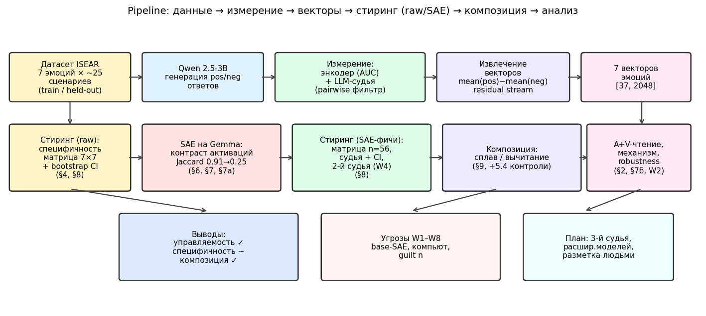
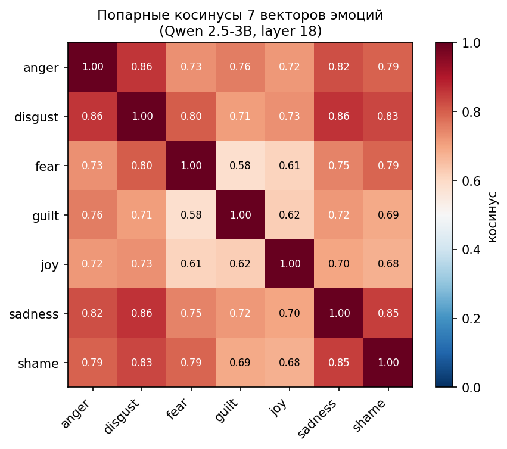
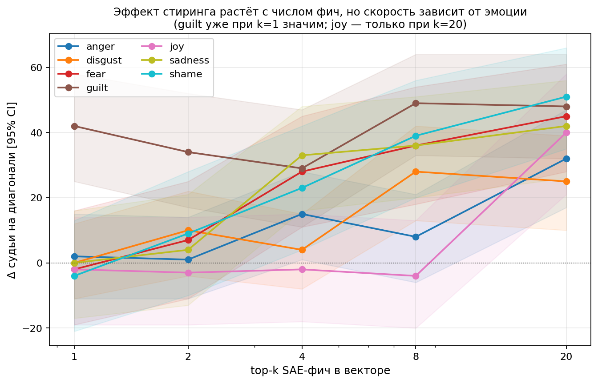
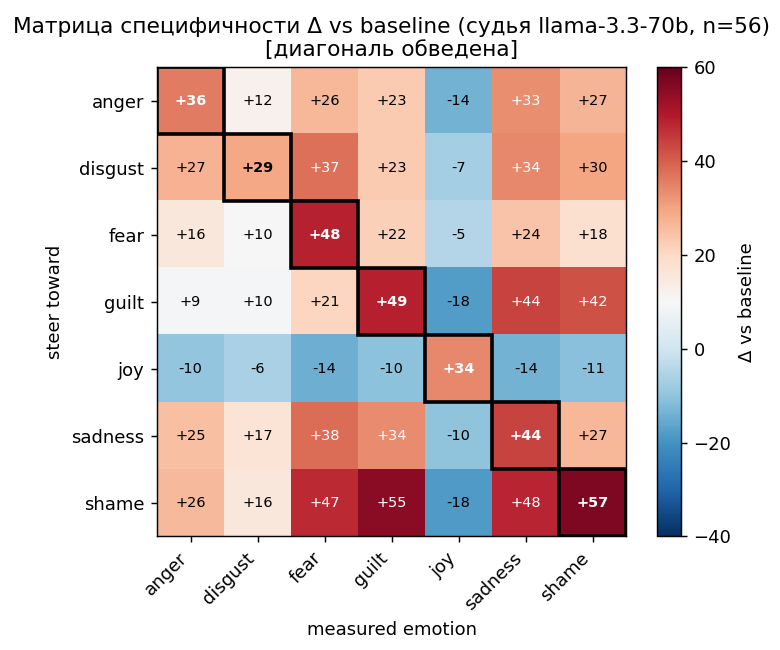
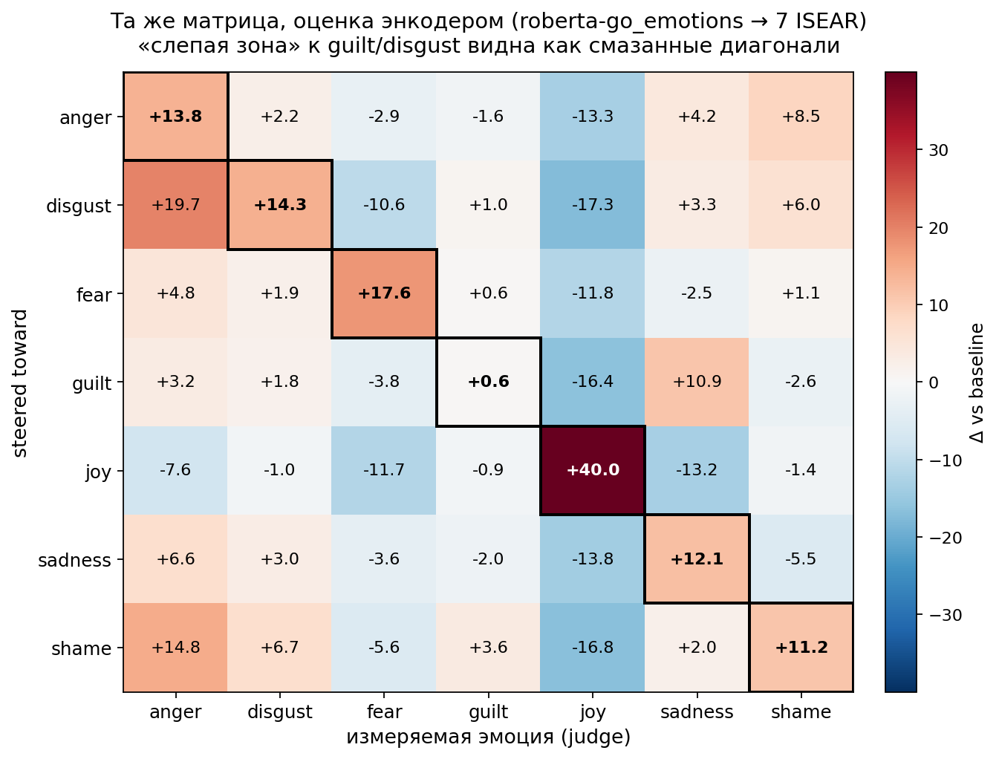
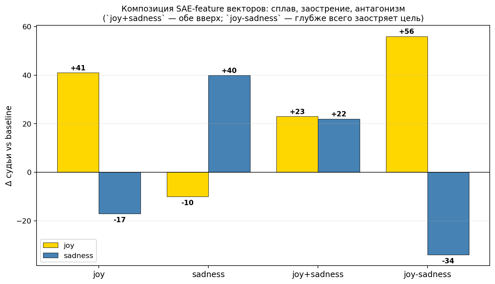
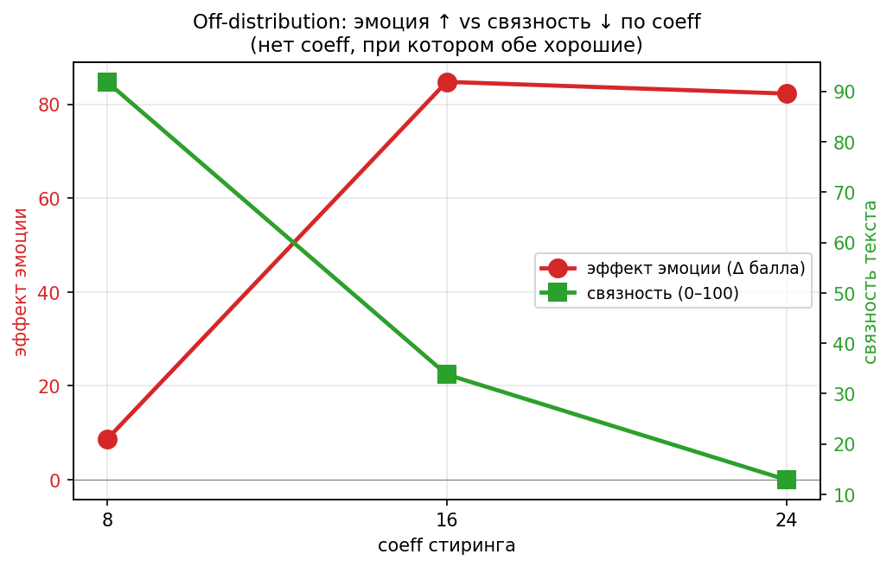
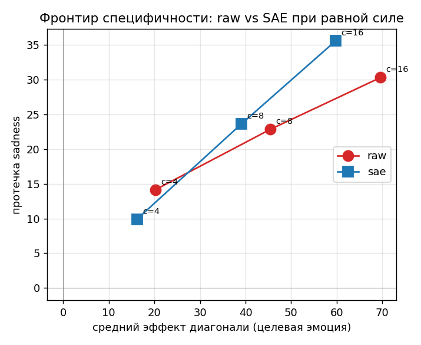
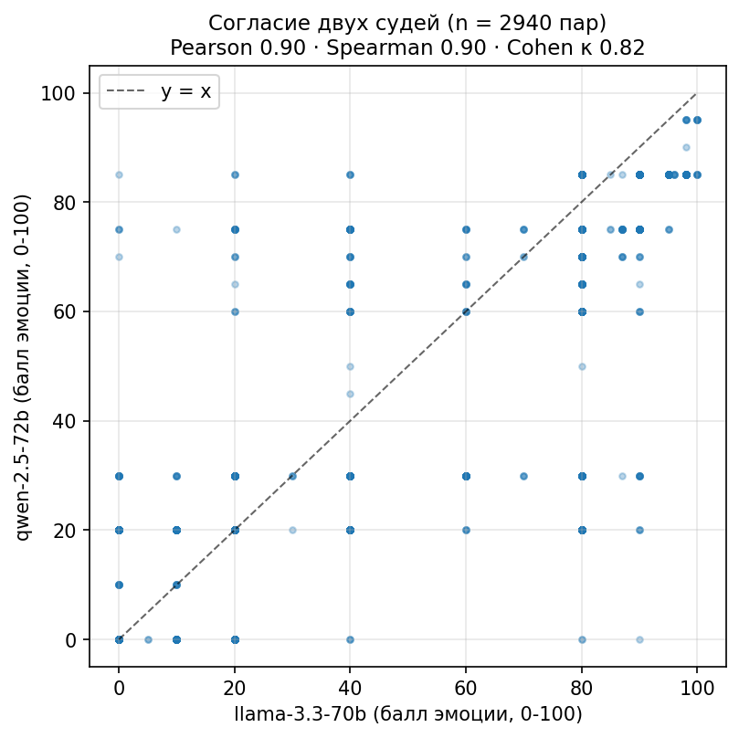

# Emotion steering vectors in LLMs — interim report

| | |
|---|---|
| **Авторы** | Uliana Kliuchnikova, Georgy Mamarin |
| **Курс** | Научная практика, 2-й семестр |
| **Версия** | v1.0 (interim) — 2026-05-30 |
| **Репозиторий** | github.com/dmagog/persona-emotions, ветка `emotion-encoder` |
| **Базис** | PERSONA (xcfcode) + Persona Vectors (arXiv 2507.21509) |

## Кратко

Перенесли метод контрастных активационных векторов с черт личности на 7 эмоций
ISEAR и проверили его на gemma-2-2b. Стиринг **наводит целевую эмоцию устойчиво**
— все 7 диагоналей значимы (судья n=56, bootstrap CI), на связном тексте
(≥82/100). Специфичность условная: target=argmax только у 4/7 (anger, fear, joy,
shame), у disgust/guilt/sadness аргмакс уезжает в соседний негативный кластер —
**fear-измерение оказывается широким аггрегатором** (под disgust Δfear +53, под
sadness Δfear +40), плюс остаётся прежний sadness-аттрактор (+25 [+16,+34]).
Вердикт устойчив ко второму судье (qwen-2.5-72b: Pearson 0.90, κ 0.82). На задаче «навести эмоцию в нейтральном
промпте» простой промптинг не уступает стирингу и даже специфичнее (7/7 argmax) —
практического выигрыша активационного стиринга на этой задаче нет. SAE-расщепление
работает на уровне отбора фич (Jaccard 0.91→0.25), но при декоде обратно в
residual направления заново запутываются — при равной силе SAE-вектор не
специфичнее сырого. Отличительная ценность активационного стиринга — в
композиционности: дозируемый сплав и хирургическое вычитание эмоций,
недостижимые инструкцией.

## Введение

Контекст. Активационный стиринг (добавление направления в residual stream) уже
показал, что чертами личности и поведением LLM можно управлять линейными векторами
(PERSONA; Persona Vectors, arXiv 2507.21509). Эмоции — естественный следующий шаг: они
дискретны, психологически структурированы (валентность/возбуждение) и важны для
безопасного и контролируемого диалога. Но переносится ли метод с устойчивых черт на
более «текучие» эмоции, и насколько чисто — открытый вопрос.

Вопросы исследования.
- RQ1 — *Управляемость:* можно ли вектором надёжно навести конкретную эмоцию?
- RQ2 — *Специфичность:* поднимается ли именно целевая эмоция, а не «эмоциональность
  вообще» / соседний кластер?
- RQ3 — *Структура и минимальность:* почему векторы эмоций скоррелированы, и можно ли
  выделить разреженное специфичное для эмоции представление (SAE-фичи)?
- RQ4 — *Ценность над промптингом:* есть ли у стиринга то, чего не даёт инструкция
  (композиция, управление вне промпта)?

Подход (пайплайн). Датасет (7 эмоций ISEAR) → независимое **измерение** эмоции
(классификатор + LLM-судья) → извлечение **векторов** (контраст pos/neg активаций) →
**стиринг** на held-out промптах → анализ **специфичности** (матрица 7×7, bootstrap CI,
два судьи) → **расщепление** (центрирование, SAE-проекция, контрастные SAE-фичи) →
**композиция** (сплав/вычитание) и контроли (промптинг-baseline, top-k, off-distribution).

Где главный вклад. Не в самом факте «эмоцию можно навести» (это умеет и промптинг),
а в (1) **методологии**: контраст активаций расщепляет фичи эмоций там, где проекция
направления проваливается; и (2) композиционности: дозируемый сплав и вычитание
эмоций — то, чего инструкцией не получить. По дороге — честная калибровка утверждений
доверительными интервалами и вторым судьёй.

Как читать. §1–3 — измерение, векторы, факт управляемости (RQ1). §4–8 —
специфичность и расщепление (RQ2, RQ3), включая методологический результат и границы
(минимальность, механизм, raw vs SAE). §9 — композиция и off-distribution (RQ4). Затем
выводы, угрозы валидности (W1–W8) и перспективы.

*Рис. 0. Архитектура: датасет → измерение → векторы → стиринг (raw + через SAE-фичи)
→ композиция и контроли → выводы/угрозы. Цвета группируют этапы; стрелки — поток данных.*

## Данные

7 эмоций ISEAR (anger, disgust, fear, guilt, joy, sadness, shame). На каждую —
~50–60 сценариев, разделённых на train и held-out. Для каждой пары инструкций
генерируются ответы Qwen2.5-3B-Instruct: `pos` (эмоциональный) и `neg`
(нейтральный) — контрастные пары.

Train/test split. Векторы, judge-фильтрация и SAE-фичи считаются на
train-сценариях; стиринг и матрицы специфичности оцениваются на held-out
сценариях. То есть отбор направлений/фич и их проверка не пересекаются по данным.

Замечание про guilt. Исходный датасет guilt (9 промптов) расширен до 25 в течение
работы (фикс Ульяны). Новые pos/neg-ответы сгенерированы (125 пар, 115 прошли
фильтр судьи, mean 74.5), guilt-вектор переэкстрагирован на Qwen и Gemma, SAE
contrastive и SAE-feature вектор пересобраны, §8а матрица пересчитана на новом
пуле n=56 (8 свежих guilt-held-out промптов). Числа §7а top-k и §9 композиции
пока на исходных артефактах — следующая итерация.

## 1. Измерение эмоции (мерило)

Два независимых измерителя текста:

- **Классификатор-энкодер** `text→вектор`: `SamLowe/roberta-base-go_emotions`
  (GoEmotions, 28 меток) с агрегацией в 7 ISEAR. Метрика — AUC (разделимость
  pos vs neg, порого-независимая).
- LLM-судья (`meta-llama/llama-3.3-70b-instruct` через OpenRouter) в двух
  режимах: pairwise (0–100, 50 = равно) — для фильтрации обучающих pos/neg
  пар; single-emotion 0–100 (`emotion/judge_steered.py`/`judge_specificity.py`) —
  для матрицы специфичности и оценки стиреных ответов. Если в тексте просто
  «судья», без оговорок — это single-emotion 0–100.

Энкодер (AUC по эмоциям): disgust 0.82, anger 0.78, shame 0.69, fear 0.70,
sadness 0.64, joy 0.62, guilt 0.62; mean AUC 0.697. Все > 0.5 — энкодер разделяет
pos/neg по всем эмоциям. *(`results/encoder_scoring_qwen2.5-3b.md`)*

Энкодер дорабатывали: в первой версии нормировка вектора по 7 ISEAR + широкий
joy-кластер «залипали» (joy: pos 0.948 / neg 0.886, всё стекалось в joy). В v2
убрали нормировку (GoEmotions multi-label) и сузили joy-кластер → mean shift
вырос 0.127 → 0.173, и появилась устойчивая AUC-метрика.

Судья + кросс-проверка: mean скоры 66.5–77.4, 832/920 пар проходят порог 60.
Оба измерителя согласны по 6 из 7 эмоций. guilt — судья видит сильный контраст
(74.2), а энкодер слабый (AUC 0.62): это ограничение энкодера (GoEmotions
`remorse` плохо ловит вину), не датасета. *(`results/judge_vs_encoder_qwen2.5-3b.md`)*

## 2. Извлечение векторов

Для 832 judge-отфильтрованных пар: residual-stream активации Qwen2.5-3B,
`mean(pos) − mean(neg)` по слоям → 7 векторов эмоций `[37, 2048]` (как в PERSONA,
формат совместим со стирингом). Прогон на домашнем RTX 2070.

Находка: попарные косинусы между векторами эмоций — 0.58–0.86 на mid-слое
Qwen (layer 18); на Gemma — близкий диапазон 0.45–0.83. Все косинусы
положительны — вектора НЕ ортогональны, доминирует общая компонента «эмоционально
vs нейтрально»; joy обособлен по валентности. (В Кратко указан объединённый диапазон
0.45–0.86 по обеим моделям.) *(`results/emotion_vectors_qwen2.5-3b.md`)*

*Рис. 1. Все косинусы положительны и высоки (0.58–0.86, Qwen layer 18), что и означает
доминирующую общую ось «эмоциональность vs нейтрально». joy имеет минимальный
средний косинус с негативными — первый признак валентностной оси.*

Почему скоррелированы — valence/arousal-чтение. Одна общая ось забирает ~80%
дисперсии 7 векторов (79–81% по слоям Qwen, 74–77% Gemma) — это «эмоциональность vs
нейтрально», отсюда высокие косинусы (а не отсутствие структуры); это устойчиво по
слоям.

В остатке после её вычитания проявляется валентность — остаточная PC1
положительно коррелирует с канонической валентностью на всех слоях (Spearman
+0.4…+0.7; ≈+0.70 на mid-слое и на Gemma); arousal в геометрии чисто не выделяется.

Эмпирически то же: по баллам судьи joy анти-коррелирует с негативным кластером
(средн. −0.51), а негативные слабо со-активируются. То есть запутанность = общая ось
эмоциональности + валентностный остаток. *(`results/valence_arousal_qwen.md`)*

## 3. Стиринг работает (RQ1)

Добавление anger-вектора в `model.layers[14]` на нейтральных held-out промптах:
anger-скор **0.033 → 0.226 → 0.465** (coeff 0/4/8), монотонно; при coeff 8 — выше,
чем у инструктированных pos-ответов (0.362). Генерация связная и по теме.
*(`results/steering_anger_qwen2.5-3b.md`)*

Полная картина по всем 7 эмоциям, с n=56 и bootstrap CI, — в §8а (на gemma-2-2b).

## 4. Специфичность сырого стиринга (RQ2, n=14 — ранняя итерация)

Матрица 7×7 (стиринг к строке → Δ измеряемой эмоции vs baseline, layer 14, coeff 8):

*Диагональ выделена жирным; значения — Δ относительно baseline.*

| steer\meas | anger | disgust | fear | guilt | joy | sadness | shame |
|---|---:|---:|---:|---:|---:|---:|---:|
| **anger** | **+0.16** | +0.00 | -0.00 | +0.04 | -0.04 | +0.23 | -0.04 |
| **disgust** | +0.16 | **+0.03** | +0.13 | +0.01 | -0.09 | +0.17 | +0.08 |
| **fear** | +0.05 | +0.01 | **+0.15** | -0.04 | +0.00 | +0.10 | +0.02 |
| guilt | +0.04 | +0.00 | +0.02 | **+0.01** | +0.04 | +0.19 | -0.01 |
| **joy** | -0.00 | +0.00 | -0.16 | -0.03 | **+0.46** | -0.15 | +0.07 |
| **sadness** | +0.08 | +0.00 | -0.07 | -0.04 | +0.00 | **+0.33** | -0.02 |
| **shame** | +0.01 | +0.01 | +0.09 | -0.03 | +0.06 | +0.18 | **+0.07** |

- **Специфичные** (диагональ — максимум): **joy** (+0.46), **sadness** (+0.33),
  **fear** (+0.15).
- **Протекающие**: anger (+0.16, но sadness +0.23), disgust/guilt/shame — целевая
  почти не растёт, всё тянет вверх **sadness**.
- «Аттрактор sadness»: почти любой стиринг поднимает грусть — на этой матрице.
  Вывод напрашивался: сырой стиринг ≈ общий аффект, а не конкретная эмоция.
  *(`results/steer_specificity_qwen2.5-3b.md`)*

> **Оговорка (важно).** Матрица — на n=14 и энкодере. На Gemma при n=56 «аттрактор sadness» исчезает
(протечка ~0, см. §8/`bootstrap_ci_n56.md`). Значит вывод про «общий аффект» может
быть артефактом малой выборки — эту матрицу нужно перепроверить на бо́льшем n
(и судьёй). Что устойчиво при n=56 — это сам факт, что стиринг поднимает целевую
эмоцию (диагональ).

## 5. Расщепление (E0): вычитание общей компоненты

Вычли средний по 7 вектор (ренорм к исходной длине), повторили матрицу:

- Аттрактор sadness убран: протечка в sadness при стиринге к не-sadness
  эмоциям **+0.12 → −0.03**.
- joy стал чище и сильнее (+0.46 → +0.71); fear остался специфичным.
- Но переусердствует: sadness схлопывается (+0.33 → +0.02) — общий вектор и
  был по сути направлением sadness; часть эмоций сменили протечку (anger→guilt,
  disgust→anger). *(`results/steer_specificity_centered_qwen2.5-3b.md`)*

Вычитание среднего — грубый инструмент: убирает доминирующую ось, но не изолирует
каждую эмоцию. → мотивация для SAE (разреженный разбор, «минимальный вектор эмоции»).

## 6. Расщепление через SAE (E1) (RQ3)

Перенесли векторы на **gemma-2-2b** (есть готовые SAE GemmaScope): векторы эмоций
Gemma так же скоррелированы (косинусы 0.45–0.83) — **запутанность не специфична
для модели**. Затем спроецировали направления эмоций на энкодер GemmaScope SAE
(`layer_12/width_16k`) и взяли топ-фичи.

- Наивная проекция: топ-фичи почти идентичны у всех эмоций, mean Jaccard 0.91.
- После центрирования (вычесть общую компоненту, потом проекция): 0.84 — почти
  не помогло.

Вывод: **проекция difference-направления на SAE не изолирует специфичные для эмоции
фичи** — несколько доминирующих фич забирают проекцию у всех. Запутанность
устойчива по всем срезам: косинусы → специфичность → центрирование → SAE-проекция.
*(`results/gemma_sae_layer12.md`)*

## 7. Контрастные активации SAE дают специфичные для эмоции фичи (E1c) (RQ3)

Правильный метод: прогнать реальные pos/neg ответы через Gemma+SAE, ранжировать
фичи по **mean(pos)−mean(neg)** активаций (контраст гасит общий фон). Результат —
эмоции занимают разные фичи:

| метод | mean off-diag Jaccard |
|-------|----------------------:|
| проекция направления, наивная | 0.91 |
| проекция, центрированная | 0.84 |
| контрастные активации | 0.25 (min 0.08) |

Есть общие фичи (общий аффект), но у каждой эмоции — свои (anger 1840/6810/8517,
disgust 6810/2746, fear 13295/2746/621, guilt 7002/8567/14602, joy 13295/1840/6648,
sadness 13295/2746/7002, shame 6810/2746/4886; топ-фичи частично пересекаются —
общий «эмоциональный фон», — но каждая эмоция имеет свой характерный ранг).
**Методологический урок:** узким местом был не SAE, а способ — проекция
направления проваливается, контраст активаций расщепляет. Это разреженный
специфичный для эмоции набор фич. *(`results/sae_contrastive_layer12.md`,
обновлено после пересборки на 115 guilt-парах: mean Jaccard 0.259, прежнее 0.252.)*

### 7а. Сколько фич достаточно — свип top-k (W6, «минимальность» измерена)

Собирали steering-вектор каждой эмоции только из top-k контрастных фич (k∈{1,2,4,8,20})
и судили эффект (судья + bootstrap CI, n=28 held-out, пересчитано на новых guilt-данных).

| k фич/эмоцию | средний эффект диагонали | значимых диагоналей | протечка sadness [CI] |
|---:|---:|:--:|---:|
| 1 | +5 | 1/7 | +7 [−6,+19] |
| 2 | +9 | 1/7 | +11 [−2,+23] |
| 4 | +19 | 5/7 | +20 [+7,+32] |
| 8 | +27 | 5/7 | +19 [+6,+31] |
| 20 | +40 | 7/7 | +25 [+12,+38] |

Полная таблица per-эмоция (Δ vs baseline, 95% CI):

| k | anger | disgust | fear | guilt | joy | sadness | shame |
|---:|---:|---:|---:|---:|---:|---:|---:|
| 1 | +2 [−11,+15] | +0 [−11,+12] | −2 [−19,+16] | **+42 [+25,+58]** | −2 [−19,+14] | −0 [−17,+16] | −4 [−21,+13] |
| 4 | +15 [+1,+28] | +4 [−8,+15] | +28 [+11,+45] | +29 [+11,+47] | −2 [−18,+15] | +33 [+16,+48] | +23 [+4,+42] |
| 8 | +8 [−6,+21] | +28 [+13,+42] | +36 [+18,+54] | +49 [+33,+64] | −4 [−20,+13] | +36 [+20,+51] | +39 [+20,+56] |
| 20 | +32 [+17,+47] | +25 [+10,+39] | +45 [+28,+61] | +48 [+32,+64] | +40 [+21,+58] | +42 [+26,+56] | +51 [+35,+66] |

- Качество монотонно растёт с k: ~4–8 фич хватает, чтобы большинство эмоций
  стирилось значимо; все 7 — только на полных 20.
- Нужное число фич зависит от эмоции: **guilt стирится одной фичей** (+42 [+25,+58]
  при k=1 — единственная значимая диагональ из 7); joy не заводится до k=20 (распределён
  по многим фичам).
- Меньше фич ≠ чище: сигнал/протечка не улучшается при урезании (k=4 ≈1:1, k=20 ≈1.5:1)
  — топ-фичи несут и общий аффект, поэтому «минимальный» вектор просто слабее, а не
  специфичнее. Это уточняет вольное прежнее «минимальный». *(`results/topk_sweep_gemma.md`)*

*Рис. 3. Эффект стиринга монотонно растёт с числом фич, но зависит от эмоции.
guilt стирится одной фичей (+42 при k=1); joy остаётся ~0 до k=20. У большинства
эмоций «горлышко» в районе k=4–8.*

### 7б. Почему расщепление не переходит в специфичность (механизм)

Фичи расщепляются на уровне **индексов** (Jaccard 0.25), но steering-вектор — это они,
**декодированные обратно** в residual (Σ Δ·W_dec[f]). Сравнили попарную запутанность
(средний off-diag косинус, layer 12) трёх наборов:

| набор векторов | mean off-diag cos | остаток общей оси |
|---|---:|---:|
| сырые | +0.66 | 0.84 |
| центрированные (raw − общая ось) | −0.16 | 0.27 |
| SAE-фичи (декод) | +0.61 | 0.48 |

Декодированный SAE-вектор почти так же запутан, как сырой (+0.61 vs +0.66) и
сохраняет ~половину общей «эмоциональной» оси (0.48). То есть расщепление на уровне фич
плохо переживает декод (строки W_dec сами скоррелированы, общие фичи доминируют в
сумме) — вот почему специфичность стиринга не растёт (W2). Простое центрирование даёт
куда меньший косинус (−0.16), но ценой пере-коррекции (§5 схлопывает sadness). Вывод:
разреженность на уровне фич ≠ ортогональность направлений стиринга.
*(`results/mechanism_ablation_gemma.md`)*

## 8. Стиринг через SAE-фичи (RQ2, RQ4)

Декодировали отобранные фичи эмоций обратно в residual (Σ Δ·W_dec[f]) и стирили
ими gemma-2-2b, рядом с сырым вектором (матрица специфичности, layer 12, coeff 8):

| | mean диагональ | target=argmax | **протечка в sadness** |
|---|---:|---:|---:|
| сырой вектор | +0.20 | 3/7 | +0.10 |
| SAE-фичи | +0.16 | 3/7 | +0.05 |

Полные матрицы Δ (стиринг к строке → измеряемая эмоция), сырой vs SAE-фичи:

**Сырой вектор (gemma, n=14, энкодер):**

| steer\meas | anger | disgust | fear | guilt | joy | sadness | shame |
|---|---:|---:|---:|---:|---:|---:|---:|
| **anger** | **+0.23** | +0.01 | -0.01 | -0.01 | -0.17 | +0.25 | +0.11 |
| **disgust** | +0.22 | **+0.15** | -0.03 | +0.08 | -0.18 | +0.19 | -0.05 |
| **fear** | +0.09 | +0.01 | **+0.22** | -0.01 | -0.13 | +0.03 | +0.04 |
| guilt | +0.02 | +0.00 | +0.10 | **+0.06** | -0.18 | +0.22 | -0.05 |
| **joy** | -0.03 | -0.01 | -0.07 | -0.02 | **+0.39** | -0.16 | +0.01 |
| **sadness** | +0.11 | +0.02 | -0.08 | -0.03 | -0.08 | **+0.22** | -0.06 |
| **shame** | +0.21 | +0.06 | +0.03 | +0.09 | -0.13 | +0.06 | +0.10 |

**SAE-фичи (gemma, n=14, энкодер):**

| steer\meas | anger | disgust | fear | guilt | joy | sadness | shame |
|---|---:|---:|---:|---:|---:|---:|---:|
| **anger** | **+0.14** | +0.04 | +0.19 | +0.03 | -0.16 | +0.01 | +0.06 |
| **disgust** | +0.02 | **+0.06** | +0.11 | +0.00 | -0.05 | +0.04 | +0.07 |
| **fear** | +0.02 | +0.00 | **+0.13** | -0.02 | -0.16 | +0.06 | -0.00 |
| guilt | +0.12 | +0.01 | -0.11 | **+0.06** | -0.18 | +0.22 | -0.04 |
| **joy** | -0.03 | -0.01 | -0.06 | +0.03 | **+0.40** | -0.04 | -0.00 |
| **sadness** | +0.06 | +0.02 | +0.09 | -0.02 | -0.16 | **+0.19** | -0.06 |
| **shame** | +0.19 | +0.03 | +0.03 | -0.01 | -0.16 | +0.01 | **+0.16** |

На малой выборке (n=14, энкодер) казалось, что feature-стиринг вдвое срезает
«аттрактор sadness» (raw +0.10 → SAE +0.05). При n=56 это не подтвердилось:
энкодерная протечка ~0 у обоих (raw +0.011 [−0.08,+0.09], SAE +0.020 [−0.07,+0.10]),
разницы raw vs SAE-фичи нет. Но энкодер здесь и сам ненадёжен — достоверный вердикт
по специфичности даёт судья на n=56 (ниже). Что устойчиво по энкодеру при n=56:
диагонали значимы у 6/7 (стиринг наводит целевую эмоцию).
*(`results/steer_sae_feature_gemma.md`, `results/bootstrap_ci_n56.md`)*

Связность. Стиринг при coeff 8 не ломает текст: судья по связности даёт всем
условиям ≥ 82/100 (baseline 95), падение умеренное (−3 у sadness/guilt … −13 у
disgust). То есть специфичность мы мерили на связных генерациях, а не на «каше».
*(`results/coherence_gemma_saefeat.md`)*

Проверка судьёй (guilt/disgust — слепая зона энкодера). Просудили стиреные
ответы LLM-судьёй: стиринг наводит целевую эмоцию по всем проверенным —
guilt 32→78 (+46), disgust 10→37, anger 14→41, joy 21→55.
«Провал» guilt/disgust в энкодерной матрице был **артефактом измерения**
(GoEmotions их не видит), а не стиринга. *(`results/judge_steered_gemma_saefeat.md`)*

### 8а. Достоверная матрица специфичности (судья, n=56, с CI)

Просудили raw-вектор стиреные ответы по всем 7 эмоциям на 56 промптах/условие.
Пул обновлён после фикса guilt (8 новых guilt-held-out промптов).

*Диагональ выделена жирным; значения — Δ балла судьи vs baseline.*

| steer\meas | anger | disgust | fear | guilt | joy | sadness | shame |
|---|---:|---:|---:|---:|---:|---:|---:|
| **anger** | **+46** | +9 | +27 | +11 | -10 | +26 | +16 |
| disgust | +49 | **+40** | +53 | +13 | -12 | +37 | +35 |
| **fear** | +29 | +10 | **+46** | +10 | -4 | +25 | +16 |
| **guilt** | +4 | +2 | +26 | **+39** | -14 | +41 | +37 |
| **joy** | -14 | -6 | -21 | -19 | **+56** | -27 | -23 |
| sadness | +33 | +18 | +40 | +19 | -12 | **+38** | +22 |
| **shame** | +27 | +17 | +54 | +51 | -19 | +48 | **+59** |

Все 7 диагоналей значимы (bootstrap 95% CI без 0): shame +59 [+48,+69],
joy +56 [+43,+69], anger +46 [+36,+56], fear +46 [+33,+57], disgust +40 [+29,+51],
guilt +39 [+25,+52], sadness +38 [+27,+48]. **target=argmax у 4/7** (anger, fear,
joy, shame). У disgust диагональ перекрывается fear (+53 > +40), у guilt — sadness
(+41) и shame (+37 ≈ +39), у sadness — fear (+40 > +38). То есть негативный
кластер шире, чем просто «sadness как аттрактор»: **fear-измерение тоже широко
ловит активацию** (под disgust/sadness аргмакс уходит в fear). Протечка в sadness
+25 [+16,+34] значима, но уже меньше прежней оценки (+28). *(`results/judge_specificity_n56.md`,
`bootstrap_ci`; обновлено после re-extract guilt-вектора на новых 115 парах.)*

*Рис. 2. Матрица Δ судьи относительно baseline; диагональ обведена. Видно: все
диагонали значимо положительны, но у 3/7 (disgust, guilt, sadness) аргмакс уходит
не на диагональ — fear-измерение и sadness-измерение шире ловят активацию. Joy
изолирован (отрицательные внедиагональные); shame — самая чистая диагональ.*

*Рис. 2б. Те же 56×8 ответы, но оценка энкодером (roberta-go_emotions → 7 ISEAR).
Шкала — Δ энкодер-балла ×100. Видно «слепое пятно»: guilt/disgust диагонали
смазаны (в GoEmotions нет соответствующих меток), всё ползёт в sadness. Это
обоснование, почему в §8а основные числа приводим по судье.*

Оговорка про измеритель. Энкодер и судья дают разную картину специфичности: на
n=14 энкодер давал ложную структуру, на n=56 наоборот *смыл* протечку (~0), тогда как
судья её видит (+25 [+16,+34]).

Это не значит автоматически, что энкодер «хуже»: возможен и обоснованный сдвиг
(LLM-судья тоже невалидирован и может иметь свою предвзятость). Твёрдое ограничение
энкодера — он структурно слеп к guilt/disgust (в GoEmotions их нет).

Поэтому основные числа здесь приводим по судье (он покрывает все 7 эмоций), а вопрос
«кто ближе к людям, энкодер или судья» оставляем открытым и решаем человеческой
разметкой (~300 примеров, single-emotion 0–100; см. план 5.3).

### 8б. Baseline «промптинг» (W7): стиринг его не превосходит

Сгенерили с pos-инструкцией эмоции (без вектора) на тех же 56 промптах и просудили
тем же судьёй; обе матрицы — на одном и том же обновлённом пуле (после фикса guilt).

| эмоция | стиринг (raw) | промптинг | разница |
|---|---:|---:|---:|
| anger | +46 [+36,+56] | +42 [+33,+50] | стиринг +4 |
| disgust | +40 [+29,+51] | +40 [+31,+50] | ≈ |
| fear | +46 [+33,+57] | **+52 [+42,+61]** | промптинг +6 |
| guilt | +39 [+25,+52] | **+56 [+46,+65]** | **промптинг +17** |
| joy | +56 [+43,+69] | +53 [+41,+65] | ≈ |
| sadness | +38 [+27,+48] | +44 [+35,+53] | промптинг +6 |
| shame | **+59 [+48,+69]** | +44 [+33,+55] | стиринг +15 |

- **target=argmax: промптинг 7/7, стиринг 4/7**.
- **Sadness-протечка: промптинг +18 [+10,+27], стиринг +25 [+16,+34]** — промптинг
  заметно специфичнее.
- Прямое сравнение: промптинг строго выигрывает по диагонали у 3/7 (guilt, fear,
  sadness), стиринг — у 2/7 (shame, anger); 2/7 практически равны (disgust, joy).

На задаче «навести эмоцию в нейтральном промпте» активационный стиринг через сырой
вектор уступает простому промптингу как по диагонали (среднее 4/7 значительно ниже),
так и по специфичности (argmax 4/7 vs 7/7, более сильная протечка). Отличительная
ценность стиринга — в композиционности и управлении вне промпта, см. §9.
*(`results/steer_vs_prompt_n56.md`, `judge_prompt_n56`)*

## 9. Композиционность — где стиринг обходит промптинг (RQ4)

Стирим линейными комбинациями SAE-feature векторов (судья n=56, CI). Это как раз
то, что промптингом не дозируешь:

- Сплав `joy+sadness`: одновременно joy +23 [+14,+33] И sadness +22 [+14,+30]
  — обе значимо вверх (управляемый «горько-сладкий» микс; у joy-одного sadness −17,
  у sadness-одного joy −10).
- Вычитание `anger − sadness` убирает «аттрактор sadness»: ко-активация sadness
  +33 → −9 (снижение +42, значимо), а anger остаётся значимым и доминирующим
  (+35 → +23 [+17,+30]). Арифметика векторов хирургически удаляет нежелательную
  эмоцию.
- `joy − sadness` заостряет цель: joy +41 → +56 [+47,+66], sadness глубже
  −17 → −34 [−42,−26]. Самая чистая композиция в наборе.

*Рис. 7. У одиночного joy-стиринга sadness уходит в минус (антагонисты по валентности);
сплав `joy+sadness` поднимает обе одновременно — управляемый «горько-сладкий» микс;
`joy−sadness` заостряет joy и глубже подавляет sadness. Композиции, недостижимые
инструкцией.*

Системность вычитания (X − sadness для всех протекающих эмоций, судья n=56 + CI,
обновлено на новом пуле). Чтобы проверить, что `anger−sadness` — не единичный трюк,
прогнали вычитание sadness для всех 5 эмоций с заметной протечкой.

Снижение sadness значимо у всех 5 (5/5 направлений): anger +42, disgust +28,
fear +33, guilt +42, shame +31. Целевая эмоция при этом сохраняется значимо у 4/5:
anger +23 [+17,+30], disgust +12 [+5,+19], fear +28 [+20,+37], shame +36 [+26,+46].

Исключение — guilt: вычитание гасит и саму вину (+6 [−2,+13], не значимо) —
guilt и sadness в этой модели слиты в один кластер; симметрично, `sadness−guilt`
не только обнуляет sadness, но и активно уводит guilt в минус (−11 [−16,−6]).
Это устойчивое сейчас наблюдение: guilt↔sadness — общее аффективное направление
у gemma-2-2b. *(`results/compose_n56`, обновлено после фикса guilt-датасета.)*

Это и есть отличительная ценность активационного стиринга: дозируемое смешивание
и вычитание эмоций (в т.ч. системное гашение найденного аттрактора) — простым
промптингом не достижимо. Цена вычитания — небольшое ослабление целевой эмоции,
регулируется коэффициентом; для очень близких эмоций (guilt↔sadness) вычитание не
разделяет их чисто. *(`results/compose_gemma.md`, `results/compose_subtract_gemma.md`)*

### 9а. Управление вне распределения — слабое при coeff 8

Проверили вторую гипотезу о ценности стиринга — «контроль независимо от промпта»: тот же
SAE-стиринг (coeff 8) на 30 **фактологических** промптах («как заварить чай»).

Результат отрезвляющий: anger/fear/guilt/sadness дают ровно 0 (ответы остаются
фактическими, почти идентичны baseline), пробиваются только joy +30 [+18,+42] и
слабее shame +18, disgust +8 (на эмоциональных промптах те же векторы давали +28..+57).

То есть стиринг усиливает то, что допускает промпт, а не навязывает эмоцию
любому тексту: жёсткая инструкция перебивает вектор на этом коэффициенте.
«Управление без/против промпта» при coeff 8 не подтвердилось. Отличительная
ценность стиринга остаётся за композиционностью (§9). *(`results/random_prompts_gemma.md`)*

*Рис. 5. Кривые расходятся в разные стороны: с ростом coeff эмоция приходит, но
ценой связности. Нет coeff, при котором обе метрики «хорошие» одновременно —
жёсткий компромисс.*

Свип coeff подтвердил **жёсткий компромисс**: ни один coeff не даёт И эмоцию вне
распределения, И связность. coeff 8 — связно (92/100), но эмоции ~0; coeff 16 — эмоция
+85, но модель бросает фактическую задачу и связность падает до 34; coeff 24 — +82 при
связности 13 (вырожденный текст). Перебить инструкцию вектором можно только разрушив
ответ; аккуратной эмоциональной окраски фактического текста этим методом не получить.
*(`results/random_coeff_sweep_gemma.md`)*

## Выводы

Кратко в трёх пунктах. (1) Стиринг эмоциями работает и проверен статистически, но
(2) на базовой задаче не обходит промптинг, а кажущиеся преимущества SAE по специфичности
оказались артефактами магнитуды и малых выборок; (3) реальная ценность метода — в
композиционности (сплав и вычитание эмоций), плюс самостоятельный **методологический**
результат про расщепление в SAE.

Сводно по вопросам исследования.

| вопрос | короткий ответ | где |
|---|---|---|
| RQ1 — управляемость | Да, стиринг наводит целевую эмоцию устойчиво (все 7 диагоналей значимы, при coeff 8 текст связный). | §3, §8 |
| RQ2 — специфичность | Условно: target=argmax у 4/7 (anger, fear, joy, shame). У disgust/guilt/sadness аргмакс уезжает в негативный кластер — fear-измерение оказывается широким аггрегатором; sadness-аттрактор +25 [+16,+34]. При равной силе SAE-вектор НЕ специфичнее raw. | §4, §8 (n=56), W2 |
| RQ3 — структура и минимальность | Корреляция = общая ось эмоциональности (~80%) + валентностный остаток; на уровне фич SAE расщепляет (Jaccard 0.91→0.25), но в residual декод снова запутан; ~4–8 фич достаточно большинству эмоций. | §2, §6–§7б |
| RQ4 — ценность над промптингом | На базовой задаче — нет (промптинг не хуже). Да в композиционности (сплав/вычитание, недостижимо инструкцией). Управление вне распределения — слабое (компромисс с связностью). | §8 (W7), §9, §9а |

Подробно:

1. **Управляемость (RQ1) — твёрдо.** Стиринг наводит целевую эмоцию устойчиво: при n=56
   все 7 диагоналей значимы (CI без 0), текст связный (≥82/100). Положительный результат.
2. **Специфичность (RQ2) — условная, с честной протечкой.** target=argmax у 4/7 (anger,
   fear, joy, shame), у остальных аргмакс уезжает в соседний негативный кластер: под
   disgust/sadness доминирует **fear-измерение** (+53 и +40), под guilt — sadness/shame
   (+41/+37 при диагонали +39). Остаётся и прежняя sadness-протечка +25 [+16,+34].
   Базовый вердикт **устойчив** ко второму судье (qwen-2.5-72b: Pearson 0.90, κ 0.82).
   Энкодер и судья дают разную картину; арбитраж «кто ближе к людям» — за человеческой
   разметкой (план 5.3).
3. **Методологический урок про SAE (RQ3).** Для направлений эмоций проекция на SAE не
   расщепляет (Jaccard 0.91), а контраст активаций — расщепляет (0.25): узкое место —
   метод, а не SAE. Минимальность измерена свипом top-k: ~4–8 фич хватает большинству
   эмоций (guilt — 1, joy — все 20). **Граница (W2):** расщепление реально на уровне
   индексов фич, но **в поведенческую специфичность стиринга при равной силе не
   переходит** — декодированный SAE-вектор в residual почти так же запутан, как сырой
   (§7б).
4. **Граница над промптингом (RQ4 базово) — отрезвляющая.** На задаче «навести эмоцию
   в нейтральном промпте» простой промптинг **не уступает** стирингу (даже специфичнее,
   7/7 argmax). На off-distribution стиринг либо не работает (coeff 8), либо ломает
   текст (coeff 16+ — модель бросает задачу или вырождается).
5. **Где стиринг всё же ценен — композиционность (RQ4).** Дозируемый сплав
   (joy+sadness — обе значимо вверх) и вычитание (anger−sadness гасит «аттрактор
   sadness» при сохранении anger; joy−sadness заостряет joy). Вычитание sadness
   системно убирает аттрактор у всех 5 протекающих эмоций (граница — guilt↔sadness
   слиты). Векторная арифметика даёт контроль, недостижимый промптингом — это и есть
   отличительная ценность активационного стиринга.

## Обсуждение

Главное напряжение работы — между уровнем **фич** и уровнем **направлений в residual**.
Контраст активаций даёт разреженное расщепление эмоций на уровне индексов SAE-фич
(off-diag Jaccard 0.91 → 0.25), но при декоде обратно в residual эти направления
запутываются почти как сырые (cos +0.61 vs +0.66). Поэтому методологический результат
про SAE-расщепление — настоящий и переносимый, а **поведенческая** специфичность стиринга
при равной силе у raw и SAE одинакова (W2). Иначе говоря: разреженность ≠ ортогональность.

Это объясняет и второе напряжение: на «навести эмоцию в нейтральном промпте» простой
промптинг не уступает стирингу (W7), а на off-distribution стиринг или почти не работает
(coeff 8), или ломает текст (coeff 16+, §9а). То есть гипотезу «вектор управляет
независимо от промпта» в наших условиях подтвердить не удалось.

Где стиринг действительно ценнее инструкции — в **векторной арифметике**: дозируемый
сплав (joy+sadness) и хирургическое вычитание (X−sadness системно гасит «аттрактор
sadness» у всех 5 протекающих эмоций). Это и есть кандидат на отличительную ценность
активационного стиринга, который требует продолжения: измерять не «можно ли навести»,
а «как далеко можно зайти композицией без потери связности».

Отдельно — урок про измеритель: энкодер и LLM-судья дают разную картину специфичности,
и без человеческой разметки нельзя объявить одного «истиной». Мы строим основной вывод
на судье потому, что он покрывает все 7 эмоций; финальный арбитраж — за людьми (план 5.3).

## Угрозы валидности

| угроза | статус | где |
|---|:--:|---|
| W1 — выборка / погрешности | ⚠ частично | главная матрица на n=56 + CI; ранний §4 — n=14 |
| W2 — магнитуда raw vs SAE | ✓ | coeff-matched + CI; SAE не специфичнее (отрезвляющий) |
| W3 — модель × измеритель | ✓ по осн. линии | вся достоверная линия — Gemma + судья |
| W4 — судья один | ✓ по 2-му судье | qwen-2.5-72b, Pearson 0.90, κ 0.82; человеч. метки — план |
| W5 — связность | ✓ | coeff 8 — ≥82/100, текст не ломается |
| W6 — «минимальность» | ✓ | свип top-k: 1 для guilt, 20 для joy, 4–8 для большинства |
| W7 — промптинг-baseline | ✓ закрыто | промптинг не уступает стирингу (отрезвляющий результат) |
| W8 — «аттрактор sadness» | ✓ + расширен | sadness +25 [+16,+34] значима; новая находка после пересборки — fear-измерение тоже широкий аггрегатор (под disgust/sadness аргмакс уходит в fear) |
| Base-SAE на instruct | ⚠ оговорка | community-практика, не на gemma-3-it |
| Компьют — один сетап | ⚠ оговорка | 1 модель, 1 слой, 1 coeff, 1 GPU; перенос — Фаза 5 |
| Прочее | ✓ guilt | guilt-пайплайн пересобран на 25 промптах: 115/125 пар (mean 74.5), вектор переэкстрагирован на Qwen и Gemma, SAE contrastive и SAE-feature вектор пересобраны, §8а матрица пересчитана на n=56 (новый пул с 8 свежими guilt-held-out). Эмоции инструкция-индуцированы — оставлено как открытое. |

Полное описание угроз и плана их закрытия — `IMPROVEMENT_PLAN.md`. Две ключевые иллюстрации:

*Рис. 4. W2 — coeff-matched сравнение. При равном эффекте диагонали SAE-вектор не специфичнее сырого, на высокой силе даже протекает больше.* *(`results/coeffmatch_gemma.md`)*

*Рис. 6. W4 — облако llama vs qwen жмётся к y=x: Pearson 0.90, Spearman 0.90, κ 0.82. Вердикт специфичности не зависит от выбора судьи.* *(`results/judge_agreement_n56.md`)*

## Перспективы и непроверенные гипотезы

Сделано в ходе усиления (см. `IMPROVEMENT_PLAN.md`): bootstrap CI, судья n=56,
coherence, промптинг-baseline (W7), композиционность + системное вычитание (§9), свип
top-k / «минимальность» (§7а, W6), механизм SAE (§7б), второй судья (W4), базовый приор
(W8), сквозная линия на одной модели/мерителе (W3), coeff-matched raw vs SAE (W2),
valence-arousal-чтение (§2), off-distribution стиринг и coeff-свип (§9а).

Непроверенные гипотезы (что предсказываем и как проверить).
- *Стиринг против противоречащей инструкции.* Навести эмоцию, когда промпт явно требует
  другую (например, «ответь радостно», а вектор — sadness). Кто победит и при каком coeff —
  чистый тест «контроля поверх инструкции».
- *Слой имеет значение.* Гипотеза: и сила стиринга, и расщепление зависят от слоя; SAE на
  нескольких слоях может дать менее запутанные направления, чем layer 12.
- *Разреженность через другой механизм.* §7б: декод top-k фич всё ещё запутан. Гипотеза:
  «raw минус общие фичи» (вычесть доминирующие общие SAE-фичи, а не топ-k конкретной
  эмоции) даст более ортогональные направления, чем и центрирование, и top-k.
- *Энкодер против судьи.* Открыто (см. W4): человеческая разметка (~300, single-emotion
  0–100) покажет, кто ближе к людям по эмоциям; не исключено, что энкодер надёжнее на
  тех 5 эмоциях, что он покрывает.

Расширение и валидация.
- Перенос на другие модели и размеры (там, где есть SAE) — обобщаемость.
- Естественные (не инструкция-индуцированные) эмоции — внешняя валидность векторов.
- Количественное A+V: корреляция с лексиконом VAD (NRC-VAD), а не только ранги.

Организационное. Согласовать с Уляной рамку новизны и деление вклада; её трек —
«традиционные методы» и часть запусков.

## Воспроизводимость

Репозиторий: github.com/dmagog/persona-emotions, ветка `emotion-encoder`. Код в
`emotion/` сгруппирован по блокам:

- **Измерение:** `space`, `encoder`, `classifier_encoder`, `metrics`, `score_csv`.
- **Судьи:** `pairwise_judge`, `run_pairwise_judge`, `judge_steered`,
  `judge_specificity`, `judge_agreement` (согласие судей).
- **Статистика:** `bootstrap_ci`, `coherence_check`.
- **Векторы и стиринг:** `extract_vectors`, `steer_eval`, `steer_specificity`,
  `steer_compose` (сплав/вычитание).
- **SAE:** `gemma_sae`, `sae_contrastive`, `build_sae_vectors`.
- **Анализ:** `valence_arousal` (A+V-чтение), `mechanism_ablation` (почему SAE),
  `build_label_sheet`+`label_correlation` (человеческая разметка).
- **Свипы:** `steer_topk_sweep`+`judge_topk_sweep`+`topk_summary` (минимальность);
  `steer_coeffmatch_sweep`+`judge_coeffmatch_sweep`+`coeffmatch_summary` (raw vs
  SAE при равной магнитуде); `steer_random_prompts`+`steer_random_coeff_sweep`
  (off-distribution).

Воспроизводящие ноутбуки — `notebooks/`. Артефакты с числами и матрицами —
`results/*.md` + CSV/JSON.

**Компьют:** домашний RTX 2070 (извлечение/стиринг/SAE/свипы на Qwen2.5-3B и
gemma-2-2b), Kaggle (энкодер на CPU), OpenRouter (LLM-судьи llama-3.3-70b и
qwen-2.5-72b).

## Вклад

- **Uliana Kliuchnikova** (соавтор):
  - Постановка задачи и базовый PERSONA-пайплайн (форк xcfcode/persona, инфраструктура
    инференса, разделение train/eval).
  - Датасет: 7 эмоций ISEAR — сценарии и инструкции для каждой эмоции, итеративная
    доработка (включая фикс guilt 9→25 промптов).
  - В работе/запланировано (Фаза 5, трек Ульяны): третий судья (deepseek) и согласие
    трёх судей; расширение по моделям и слоям (llama/gemma, base/instruct, разные
    слои), при возможности через SAE Lens; «традиционные методы» как baseline
    (методы из исходной работы первого полугодия); вклад в человеческую разметку.

- **Georgy Mamarin** (соавтор):
  - Блок измерения: классификатор-энкодер на GoEmotions с агрегацией в 7 ISEAR, AUC,
    редизайн в pairwise LLM-судью, кросс-проверка энкодера и судьи.
  - Извлечение векторов эмоций и стиринг; матрицы специфичности (сырая, SAE-feature
    и центрированная), bootstrap 95% CI.
  - Расщепление: центрирование (E0), SAE-проекция (E1) с провалом, контрастные
    активации SAE (E1c) — разреженное расщепление фич (Jaccard 0.91→0.25).
  - Стиринг через SAE-фичи и судейская оценка специфичности на n=56.
  - Усиление методологии: проверка связности (W5), baseline-промптинг (W7),
    композиционность и системное вычитание (§9), свип top-k / «минимальность»
    (§7а, W6), механизм-абляция SAE (§7б), валидация вторым судьёй qwen-2.5-72b
    (W4), базовый эмоциональный приор (W8), coeff-matched сравнение raw vs SAE
    (W2), valence-arousal-чтение корреляций (§2), off-distribution стиринг и
    coeff-свип (§9а), инструментарий человеческой разметки (encoder vs judge).
  - Инфраструктура и отчёт: bootstrap CI, инкрементальные чекпойнты у судьи и
    у инференса, единый формат результатов в `results/*.md`, REPORT.md и
    хуманизированная версия.
